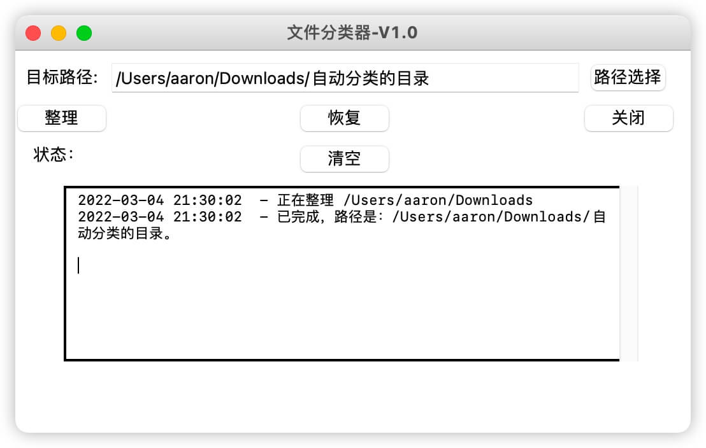

# 文件分类器

我的「下载文件夹」经常翻好久才找到想要的东西，于是就做了这样一个工具，它有两个功能：

- 1、选择一个目录，将该目录下的文件(非递归)，安装文件的扩展名，分类存放到单独的目录。

- 2、选择一个目录，将该目录下的所有文件（递归），放到该目录的父目录中，相当于功能 1 的逆操作吧。该操作存在同名文件覆盖的情况，有一定的风险，因此会有对话框让你确认。

## 界面



## 配置文件信息

[config.json](./config/config.json)

## 使用方法

```sh
python main.py
```

## 打包好的文件

### Windows

### Mac
