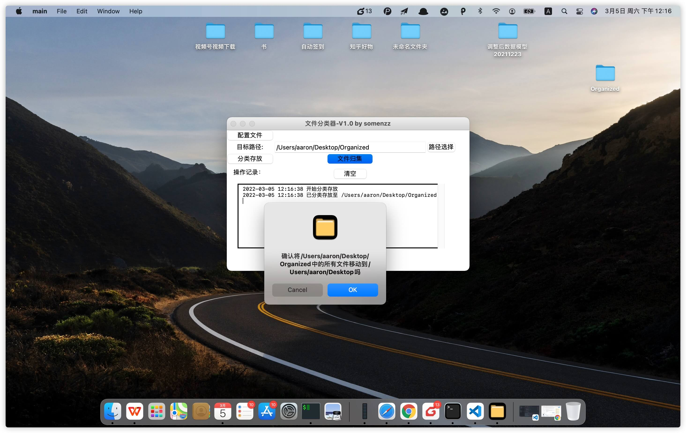

# 文件分类&归集器-by somenzz

我的电脑桌面，下载文件夹里面文件太多了，堆在一起，经常翻好久才找到想要的东西，很烦。

于是就做了这样一个工具，它有两个功能：

1. 选择一个目录，将该目录下的文件(不含目录)，按照文件的扩展名，分类存放到单独的目录。如果目录太短，会弹框确认。

2. 选择一个目录，将该目录下的所有文件（包括子目录），移动到该目录的父目录中，可以用于功能 1 的回滚。该操作存在同名文件覆盖的情况，有一定的风险，因此会有对话框让你确认。

## 界面





## 配置文件信息

[config.json](./config.json)

## 使用方法

#### 从源码运行：

1. GUI
```sh
git clone https://github.com/somenzz/folder_organize.git 
python3 main.py
```

2. 命令行

对某一目录分类存放：

```sh
python file_organize.py organize /Users/aaron/Desktop
```
对某一目录文件收集：

```sh
python file_organize.py collect /Users/aaron/Desktop
```


#### 打包好的文件

点击下载：

Mac 使用时确保-系统偏好设置-安全性与隐私-允许从以下位置下载的App-任何来源

[Mac](https://github.com/somenzz/folder_organize/releases/download/v1.0/V1.0.app.zip)


[Windows](https://github.com/somenzz/folder_organize/releases/download/v1.0/V1.0.exe)


## 技术交流群

扫下方二维码，关注「Python七号」，加入技术交流群。

